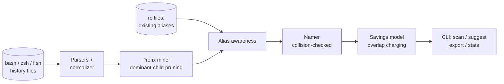

# aliasmine

[English](README.md) | [中文](README.zh.md) | [日本語](README.ja.md)

[](LICENSE) [](CHANGELOG.md) [](pyproject.toml)  [](CONTRIBUTING.md)

**aliasmine：オープンソースのシェル履歴マイナー——何百回も打ち直している長いコマンドを見つけ出し、衝突チェック済みの alias を、節約できる打鍵数の定量値つきで提案する。**


```bash
git clone https://github.com/JaydenCJ/aliasmine && cd aliasmine && pip install -e .
```

> **プレリリース：** aliasmine はまだ PyPI に公開されていません。初回リリースまでは [JaydenCJ/aliasmine](https://github.com/JaydenCJ/aliasmine) をクローンし、リポジトリのルートで `pip install -e .` を実行してください。ランタイム依存はゼロ——標準ライブラリだけで動きます。

## なぜ aliasmine？

ネット上のあらゆる alias 資源は他人の習慣を押しつけてくる：厳選 200 本の git ショートカット集のうち実際に使うのは 4 本、その一方であなた自身の最悪の習慣——1 日 9 回打っている 37 文字の `kubectl` 呪文——には誰も名前を付けてくれない。aliasmine はこれを逆転させる：*あなた自身の* bash/zsh/fish 履歴を読み、完全な繰り返しと安定したコマンド語幹（メッセージが毎回変わる `git commit -m`）を掘り出し、証拠から計算した alias を提案する。各提案には打鍵数の値札が付き、いま使っているコマンドと既存の alias に照らして検査されるので、実在するものを覆い隠すことは決してない。履歴ファイルを読んで表示するだけ——何もアップロードせず、頼まれない限り何も書き込まない。

|  | aliasmine | oh-my-zsh プラグイン | zsh-you-should-use | atuin |
|---|---|---|---|---|
| alias の出どころ | 自分の履歴から採掘 | 採用するだけの厳選パック | 既存のものを通知するだけ | なし——履歴検索ツール |
| 「これを 340 回打った」という証拠 | あり、提案ごとに付く | なし | なし | 統計はあるが提案はない |
| 自分のツール・alias との衝突チェック | あり | なし（パック同士は衝突し放題） | 対象外 | 対象外 |
| 語幹マイニング（`git commit -m` + 変わる引数） | あり | なし | 完全一致のみ | なし |
| 読める / 書き出せるシェル | bash・zsh・fish / 3 つすべて | zsh のみ | zsh のみ | bash・zsh・fish・nu・xonsh |
| ランタイムの重さ | Python 標準ライブラリ、デーモンなし | フレームワーク + プラグイン | プラグイン | Rust デーモン + データベース |

<sub>比較は 2026-07 時点の各上流ドキュメントに基づく。zsh-you-should-use は定義済み alias を思い出させるだけ；atuin は履歴保存を検索可能なデータベースに置き換える（同期サーバーは任意）。どちらも新しい alias を提案しないが、それこそがここでの仕事のすべてだ。aliasmine の依存数は [pyproject.toml](pyproject.toml) の `dependencies = []` の通り。</sub>

## 特徴

- **証拠から生まれる提案** —— どの提案にもそのコマンドを打った回数が添えられる；レポートの見出し（「`git status` を 340 回打った」）は計算結果であり、コピーライティングではない。
- **完全一致だけでなく語幹も採掘** —— トークン接頭辞の分析と「支配的な子」ルールで、百通りのコミットメッセージの陰にある `git commit -m` を発見；末尾が変わらないなら、無意味な `docker compose` 語幹ではなく `docker compose up -d` を提案する。
- **決して衝突しない命名** —— 生成された alias は約 180 の一般的な実行ファイル、あなたの履歴に現れる全プログラム、既存の alias と照合される；`cargo doc` が `cd` として提案されることは絶対にない。
- **正直な帳簿** —— 打鍵数の合計は正確な算術で、語幹と子コマンドの提案が重なっても打鍵を二重に数えず、時間見積もりは WPM ベースの推定値だと明記する。
- **手持ちの alias を尊重** —— `--existing` に任意の rc ファイルを渡せば、カバー済みのコマンドは再提案されず、定義したのに全文を打ち続けている alias はレポートで名指しされる。
- **3 シェル入力、3 シェル出力** —— bash（`HISTTIMEFORMAT` 対応）、zsh（`EXTENDED_HISTORY`・複数行・metafied バイト）、fish を読み、bash/zsh には `alias` 行を、fish には `abbr` 定義を書き出す。
- **オフライン・決定的・依存ゼロ** —— 純粋な標準ライブラリ、ネットワークなし、テレメトリなし；同じ履歴からは常にバイト単位で同一のレポートが生まれる。

## クイックスタート

インストールして、同梱のサンプル履歴（または自分のもの）に向ける：

```bash
git clone https://github.com/JaydenCJ/aliasmine && cd aliasmine && pip install -e .
aliasmine scan examples/sample_zsh_history --top 8
```

実際にキャプチャした出力：

```text
aliasmine — mined 1,694 history entries from examples/sample_zsh_history (zsh)

  unique commands                50
  repeated long commands         45
  keystrokes on repeats      26,926

   #   TIMES  COMMAND                                       KEYSTROKES
   1     340  git status                                         3,400  ████████████
   2     118  git push origin main                               2,360  ████
   3      87  docker compose up -d                               1,740  ███
   4     128  docker compose +                                   1,792  █████
   5      58  kubectl get pods -n staging                        1,566  ██
   6      96  git pull --rebase                                  1,632  ███
   7     287  npm run +                                          2,009  ██████████
   8     152  npm run dev                                        1,672  █████
      + = a common stem; the arguments after it vary

You typed `git status` 340 times — 3,400 keystrokes. Alias `gs` would have saved 2,720.

18 aliases proposed — 18,927 keystrokes (~1h 03m at 60 WPM). Run `aliasmine suggest` to see them.
```

提案を確認して採用する：

```bash
aliasmine suggest examples/sample_zsh_history
aliasmine export examples/sample_zsh_history --format zsh >> ~/.zshrc
```

自分のマシンでは引数なしで実行すればよい——`$HISTFILE` と bash/zsh/fish の標準的な場所が自動で探索される。`--existing ~/.zshrc` を付ければ手持ちの alias を把握し、機械可読な出力が欲しい場所ではどこでも `--json` を付ければいい。

## オプション

すべてのサブコマンド（`scan`・`suggest`・`export`・`stats`）は同じつまみを共有するので、レポート間で数字が一致する：

| キー | 既定値 | 効果 |
|---|---|---|
| `--min-count N` | `5` | N 回以上打ったコマンドだけを採掘する |
| `--min-length N` | `6` | N 文字より短いコマンドを無視する |
| `--max N` | `20` | 提案する alias を最大 N 件にする |
| `--wpm N` | `60` | あなたのタイピング速度（時間見積もり用） |
| `--existing FILE` | なし | 既存 alias を含む rc ファイル（複数指定可） |
| `--shell` | `auto` | ファイルごとに `bash`・`zsh`・`fish` の解析を強制 |
| `--color` | `auto` | `always` / `never`；`auto` は `NO_COLOR` とパイプを尊重 |
| `--json` | オフ | 機械可読な出力（`scan`・`suggest`・`stats`） |

採掘・支配的な子の剪定・ランキング・重複課金の仕組みは [`docs/mining.md`](docs/mining.md) に厳密に規定されている——レポートのどの数字も手計算で再現できる。

## 検証

このリポジトリは CI を持たない；上記の主張はすべてローカル実行で検証される。このリポジトリのチェックアウトから再現するには：

```bash
pip install -e '.[dev]' && pytest && bash scripts/smoke.sh
```

出力（実際の実行からコピーし、`...` で省略）：

```text
93 passed in 0.47s
...
[scan] aliasmine — mined 1,694 history entries from .../examples/sample_zsh_history (zsh)
SMOKE OK
```

## アーキテクチャ



## ロードマップ

- [x] 3 シェル履歴リーダー、語幹マイニング、衝突チェック命名、節約モデル、scan/suggest/export/stats CLI（v0.1.0）
- [ ] PyPI 公開（`pip install aliasmine`）
- [ ] `apply` コマンド：バックアップと取り消しつきで rc ファイルに直接書き込む
- [ ] 新しさの重み付け——先月の習慣を去年のものより上位に
- [ ] PowerShell 履歴対応（`ConsoleHost_history.txt`）
- [ ] 引数スロット検出：変化する部分がコマンド中央にあるときは shell 関数を提案

完全なリストは [open issues](https://github.com/JaydenCJ/aliasmine/issues) を参照。

## コントリビュート

コントリビュート歓迎——まずは [good first issue](https://github.com/JaydenCJ/aliasmine/issues?q=is%3Aissue+is%3Aopen+label%3A%22good+first+issue%22) から、あるいは [discussion](https://github.com/JaydenCJ/aliasmine/discussions) を立ててほしい。開発環境の構築は [CONTRIBUTING.md](CONTRIBUTING.md) を参照。

## ライセンス

[MIT](LICENSE)
