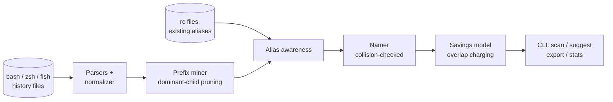

# aliasmine

[English](README.md) | [中文](README.zh.md) | [日本語](README.ja.md)

[](LICENSE) [](CHANGELOG.md) [](pyproject.toml)  [](CONTRIBUTING.md)

**aliasmine：an open-source shell-history miner — finds the long commands you retype hundreds of times and proposes collision-checked aliases with quantified keystroke savings.**


```bash
git clone https://github.com/JaydenCJ/aliasmine && cd aliasmine && pip install -e .
```

> **Pre-release:** aliasmine is not yet published to PyPI. Until the first release, clone [JaydenCJ/aliasmine](https://github.com/JaydenCJ/aliasmine) and run `pip install -e .` from the repository root. Zero runtime dependencies — the standard library is all it needs.

## Why aliasmine?

Every alias resource on the internet hands you somebody else's habits: a curated pack of 200 git shortcuts of which you will use four, while your actual worst habit — that 37-character `kubectl` incantation you type nine times a day — goes unnamed. aliasmine inverts this: it reads *your* bash/zsh/fish history, mines it for exact repeats and stable command stems (`git commit -m` with ever-changing messages), and proposes aliases computed from evidence, each one priced in keystrokes and checked against the commands and aliases you already use so it never shadows anything real. It reads your history files and prints; nothing is uploaded, nothing is written unless you ask.

|  | aliasmine | oh-my-zsh plugins | zsh-you-should-use | atuin |
|---|---|---|---|---|
| Where aliases come from | mined from your own history | curated pack you adopt | your existing ones (reminders) | none — it's history search |
| "You typed this 340 times" evidence | Yes, per suggestion | No | No | stats, but no proposals |
| Collision checks vs your tools & aliases | Yes | No (packs collide freely) | n/a | n/a |
| Prefix stems (`git commit -m` + varying args) | Yes | No | exact matches only | No |
| Shells read / exported | bash, zsh, fish / all three | zsh only | zsh only | bash, zsh, fish, nu, xonsh |
| Runtime footprint | Python stdlib, no daemon | framework + plugin | plugin | Rust daemon + database |

<sub>Comparison reflects upstream documentation as of 2026-07. zsh-you-should-use reminds you of aliases you already defined; atuin replaces history storage with a searchable database (optional sync server). Neither proposes new aliases, which is the entire job here. aliasmine's dependency count is `dependencies = []` in [pyproject.toml](pyproject.toml).</sub>

## Features

- **Suggestions mined from evidence** — every proposal cites how many times you typed the command; the report headline ("You typed `git status` 340 times") is computed, not copywritten.
- **Stem mining, not just exact matches** — token-prefix analysis with a dominant-child rule finds `git commit -m` behind a hundred different messages, and proposes `docker compose up -d` instead of a useless `docker compose` stem when the tail never varies.
- **Names that never collide** — generated aliases are checked against ~180 common executables, every program that appears in your own history, and your existing aliases; `cargo doc` will never be offered as `cd`.
- **Honest accounting** — keystroke totals are exact arithmetic, overlapping stem/child suggestions never double-count a keystroke, and time estimates are labelled as WPM-based estimates.
- **Respects the aliases you have** — point `--existing` at any rc file; covered commands are not re-suggested, and the report calls out aliases whose expansion you keep typing in full anyway.
- **Three shells in, three shells out** — reads bash (with `HISTTIMEFORMAT`), zsh (`EXTENDED_HISTORY`, multi-line, metafied bytes), and fish; exports `alias` lines for bash/zsh or `abbr` definitions for fish.
- **Offline, deterministic, dependency-free** — pure standard library, no network, no telemetry; the same history always produces byte-identical reports.

## Quickstart

Install, then point it at the bundled sample history (or your own):

```bash
git clone https://github.com/JaydenCJ/aliasmine && cd aliasmine && pip install -e .
aliasmine scan examples/sample_zsh_history --top 8
```

Real captured output:

```text
aliasmine — mined 1,694 history entries from examples/sample_zsh_history (zsh)

  unique commands                50
  repeated long commands         45
  keystrokes on repeats      26,926

   #   TIMES  COMMAND                                       KEYSTROKES
   1     340  git status                                         3,400  ████████████
   2     118  git push origin main                               2,360  ████
   3      87  docker compose up -d                               1,740  ███
   4     128  docker compose +                                   1,792  █████
   5      58  kubectl get pods -n staging                        1,566  ██
   6      96  git pull --rebase                                  1,632  ███
   7     287  npm run +                                          2,009  ██████████
   8     152  npm run dev                                        1,672  █████
      + = a common stem; the arguments after it vary

You typed `git status` 340 times — 3,400 keystrokes. Alias `gs` would have saved 2,720.

18 aliases proposed — 18,927 keystrokes (~1h 03m at 60 WPM). Run `aliasmine suggest` to see them.
```

See the proposals and adopt them:

```bash
aliasmine suggest examples/sample_zsh_history
aliasmine export examples/sample_zsh_history --format zsh >> ~/.zshrc
```

On your own machine, run it with no arguments — `$HISTFILE` and the standard bash/zsh/fish locations are probed automatically. Add `--existing ~/.zshrc` so it knows what you already have, and `--json` anywhere you want machine-readable output.

## Options

All subcommands (`scan`, `suggest`, `export`, `stats`) share the same knobs, so the numbers agree across reports:

| Key | Default | Effect |
|---|---|---|
| `--min-count N` | `5` | only mine commands typed at least N times |
| `--min-length N` | `6` | ignore commands shorter than N characters |
| `--max N` | `20` | propose at most N aliases |
| `--wpm N` | `60` | your typing speed, for time estimates |
| `--existing FILE` | none | rc file(s) with aliases you already have (repeatable) |
| `--shell` | `auto` | force `bash`, `zsh`, or `fish` parsing per file |
| `--color` | `auto` | `always` / `never`; `auto` respects `NO_COLOR` and pipes |
| `--json` | off | machine-readable output (`scan`, `suggest`, `stats`) |

How the mining, dominant-child pruning, ranking, and overlap charging work is specified precisely in [`docs/mining.md`](docs/mining.md) — every number in a report can be reproduced by hand.

## Verification

This repository ships no CI; every claim above is verified by local runs. Reproduce them from a checkout of this repository:

```bash
pip install -e '.[dev]' && pytest && bash scripts/smoke.sh
```

Output (copied from a real run, truncated with `...`):

```text
93 passed in 0.47s
...
[scan] aliasmine — mined 1,694 history entries from .../examples/sample_zsh_history (zsh)
SMOKE OK
```

## Architecture



## Roadmap

- [x] Three-shell history readers, stem mining, collision-checked naming, savings model, scan/suggest/export/stats CLI (v0.1.0)
- [ ] PyPI release with `pip install aliasmine`
- [ ] `apply` command: write exports into the rc file with a backup and an undo
- [ ] Recency weighting so last month's habits outrank last year's
- [ ] PowerShell history support (`ConsoleHost_history.txt`)
- [ ] Argument-slot detection: propose shell functions when the varying part sits mid-command

See the [open issues](https://github.com/JaydenCJ/aliasmine/issues) for the full list.

## Contributing

Contributions are welcome — start with a [good first issue](https://github.com/JaydenCJ/aliasmine/issues?q=is%3Aissue+is%3Aopen+label%3A%22good+first+issue%22) or open a [discussion](https://github.com/JaydenCJ/aliasmine/discussions). See [CONTRIBUTING.md](CONTRIBUTING.md) for the development setup.

## License

[MIT](LICENSE)
