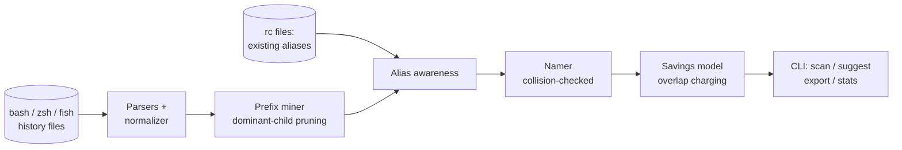

# aliasmine

[English](README.md) | [中文](README.zh.md) | [日本語](README.ja.md)

[](LICENSE) [](CHANGELOG.md) [](pyproject.toml)  [](CONTRIBUTING.md)

**aliasmine：开源的 shell 历史挖掘器——找出你重打了几百遍的长命令，提出经过冲突检查的 alias 建议，并精确量化省下的键击数。**


```bash
git clone https://github.com/JaydenCJ/aliasmine && cd aliasmine && pip install -e .
```

> **预发布：** aliasmine 尚未发布到 PyPI。首个正式版之前，请克隆 [JaydenCJ/aliasmine](https://github.com/JaydenCJ/aliasmine) 并在仓库根目录执行 `pip install -e .`。零运行时依赖——只需要标准库。

## 为什么选 aliasmine？

网上所有 alias 资源塞给你的都是别人的习惯：一个精选的 200 条 git 快捷方式包，你真正用得上的只有四条，而你自己最糟糕的习惯——那条一天要敲九遍、37 个字符长的 `kubectl` 咒语——却始终无人命名。aliasmine 把这件事反过来做：它读*你自己的* bash/zsh/fish 历史，从中挖掘完全重复的命令和稳定的命令词干（消息永远在变的 `git commit -m`），基于证据计算出 alias 建议，每条都标好省下的键击数，并对照你正在用的命令和已有的 alias 做检查，绝不会遮蔽任何真实存在的东西。它只读历史文件然后打印；不上传任何数据，不经你要求不写任何文件。

|  | aliasmine | oh-my-zsh 插件 | zsh-you-should-use | atuin |
|---|---|---|---|---|
| alias 从哪来 | 从你自己的历史挖出 | 照单全收的精选包 | 只提醒你已有的 | 无——它是历史搜索 |
| 「这条你敲了 340 遍」的证据 | 有，每条建议都附 | 无 | 无 | 有统计，但不给建议 |
| 对照你的工具和 alias 做冲突检查 | 有 | 无（包之间随意冲突） | 不适用 | 不适用 |
| 词干挖掘（`git commit -m` + 变化的参数） | 有 | 无 | 仅精确匹配 | 无 |
| 读取 / 导出的 shell | bash、zsh、fish / 三者全部 | 仅 zsh | 仅 zsh | bash、zsh、fish、nu、xonsh |
| 运行时足迹 | Python 标准库，无守护进程 | 框架 + 插件 | 插件 | Rust 守护进程 + 数据库 |

<sub>对比基于 2026-07 各上游文档。zsh-you-should-use 只提醒你用已定义的 alias；atuin 用可搜索数据库替换历史存储（可选同步服务器）。两者都不提出新 alias，而那正是这里的全部工作。aliasmine 的依赖数即 [pyproject.toml](pyproject.toml) 中的 `dependencies = []`。</sub>

## 特性

- **建议来自证据** —— 每条提案都标注你敲过这条命令多少遍；报告头条（「你敲了 `git status` 340 遍」）是算出来的，不是文案写出来的。
- **词干挖掘，不止精确匹配** —— token 前缀分析加「优势子节点」规则，能从一百条不同的提交消息背后找出 `git commit -m`；而当尾部从不变化时，它会建议 `docker compose up -d` 而不是无用的 `docker compose` 词干。
- **命名绝不冲突** —— 生成的 alias 会对照约 180 个常见可执行程序、你历史中出现过的所有程序、以及你已有的 alias 逐一检查；`cargo doc` 永远不会被提议为 `cd`。
- **诚实的账本** —— 键击总数是精确算术，词干/子命令建议重叠时绝不重复计数，时间估算明确标注为基于 WPM 的估计值。
- **尊重你已有的 alias** —— 用 `--existing` 指向任意 rc 文件；已覆盖的命令不会被重复建议，报告还会点名那些你定义了却仍全文照打的 alias。
- **三种 shell 进，三种 shell 出** —— 读 bash（含 `HISTTIMEFORMAT`）、zsh（`EXTENDED_HISTORY`、多行、metafied 字节）和 fish；为 bash/zsh 导出 `alias` 行，为 fish 导出 `abbr` 定义。
- **离线、确定性、零依赖** —— 纯标准库，无网络，无遥测；同样的历史永远产出逐字节相同的报告。

## 快速上手

安装后指向内置的示例历史（或你自己的）：

```bash
git clone https://github.com/JaydenCJ/aliasmine && cd aliasmine && pip install -e .
aliasmine scan examples/sample_zsh_history --top 8
```

真实捕获的输出：

```text
aliasmine — mined 1,694 history entries from examples/sample_zsh_history (zsh)

  unique commands                50
  repeated long commands         45
  keystrokes on repeats      26,926

   #   TIMES  COMMAND                                       KEYSTROKES
   1     340  git status                                         3,400  ████████████
   2     118  git push origin main                               2,360  ████
   3      87  docker compose up -d                               1,740  ███
   4     128  docker compose +                                   1,792  █████
   5      58  kubectl get pods -n staging                        1,566  ██
   6      96  git pull --rebase                                  1,632  ███
   7     287  npm run +                                          2,009  ██████████
   8     152  npm run dev                                        1,672  █████
      + = a common stem; the arguments after it vary

You typed `git status` 340 times — 3,400 keystrokes. Alias `gs` would have saved 2,720.

18 aliases proposed — 18,927 keystrokes (~1h 03m at 60 WPM). Run `aliasmine suggest` to see them.
```

查看提案并采纳：

```bash
aliasmine suggest examples/sample_zsh_history
aliasmine export examples/sample_zsh_history --format zsh >> ~/.zshrc
```

在自己的机器上不带参数直接运行即可——`$HISTFILE` 和 bash/zsh/fish 的标准位置会被自动探测。加上 `--existing ~/.zshrc` 让它知道你已经有什么，任何地方想要机器可读输出就加 `--json`。

## 选项

所有子命令（`scan`、`suggest`、`export`、`stats`）共享同一组旋钮，因此各报告的数字彼此一致：

| 键 | 默认值 | 作用 |
|---|---|---|
| `--min-count N` | `5` | 只挖掘敲过至少 N 遍的命令 |
| `--min-length N` | `6` | 忽略短于 N 个字符的命令 |
| `--max N` | `20` | 最多提议 N 条 alias |
| `--wpm N` | `60` | 你的打字速度，用于时间估算 |
| `--existing FILE` | 无 | 含你已有 alias 的 rc 文件（可重复） |
| `--shell` | `auto` | 按文件强制 `bash`、`zsh` 或 `fish` 解析 |
| `--color` | `auto` | `always` / `never`；`auto` 尊重 `NO_COLOR` 与管道 |
| `--json` | 关 | 机器可读输出（`scan`、`suggest`、`stats`） |

挖掘、优势子节点剪枝、排序和重叠计费的工作方式在 [`docs/mining.md`](docs/mining.md) 中有精确定义——报告里的每个数字都能手工复算。

## 验证

本仓库不带 CI；上面的每一条声明都由本地运行验证。从本仓库的检出中复现：

```bash
pip install -e '.[dev]' && pytest && bash scripts/smoke.sh
```

输出（摘自一次真实运行，用 `...` 截断）：

```text
93 passed in 0.47s
...
[scan] aliasmine — mined 1,694 history entries from .../examples/sample_zsh_history (zsh)
SMOKE OK
```

## 架构



## 路线图

- [x] 三 shell 历史读取、词干挖掘、冲突检查命名、节省核算、scan/suggest/export/stats CLI（v0.1.0）
- [ ] 发布到 PyPI，支持 `pip install aliasmine`
- [ ] `apply` 命令：把导出写进 rc 文件，带备份和撤销
- [ ] 近因加权，让上个月的习惯排在去年的前面
- [ ] PowerShell 历史支持（`ConsoleHost_history.txt`）
- [ ] 参数槽检测：当变化部分位于命令中间时改为提议 shell 函数

完整列表见 [open issues](https://github.com/JaydenCJ/aliasmine/issues)。

## 贡献

欢迎贡献——从一个 [good first issue](https://github.com/JaydenCJ/aliasmine/issues?q=is%3Aissue+is%3Aopen+label%3A%22good+first+issue%22) 开始，或发起一个 [discussion](https://github.com/JaydenCJ/aliasmine/discussions)。开发环境搭建见 [CONTRIBUTING.md](CONTRIBUTING.md)。

## 许可证

[MIT](LICENSE)
